# **NS-3网络仿真平台搭建**

物联网2303 邱佳亮 3230611072

## 准备工作

书籍：《开源网络模拟器ns-3 架构与实践》周迪之

官方文档阅读：[Installation - Nsnam](https://www.nsnam.org/wiki/Installation) [Documentation | ns-3](https://www.nsnam.org/documentation/)

环境：VMware 17.6.2  Ubuntu24.10

- 环境配置

打开命令行窗口，输入sudo apt-get update更新软件包：

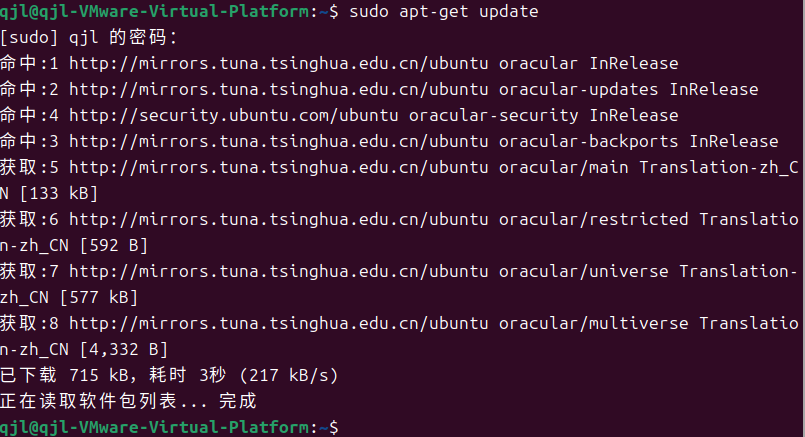

图 1 更新软件包

输入命令安装以下依赖：

C++和python安装（必须）：sudo apt-get install gcc g++ python python

NS3代码维护使用的源码版本控制管理系统：sudo apt-get install mercurial

运行python绑定ns-3-dev需要bazaar这个组件：sudo apt-get install bzr

基于GTK的配置系统：sudo apt-get install libgtk2.0-0 libgtk2.0-dev

调试工具：sudo apt-get install gdb valgrind

文档生成器：sudo apt-get install doxygen graphviz imagemagick

仿真必需的词法分析器和语法分析生成器（必须）：sudo apt-get install flex 		bison

读取pcap的packet traces，即包嗅探器：sudo apt-get install tcpdump

xml的配置存储软件：sudo apt-get install libxml2

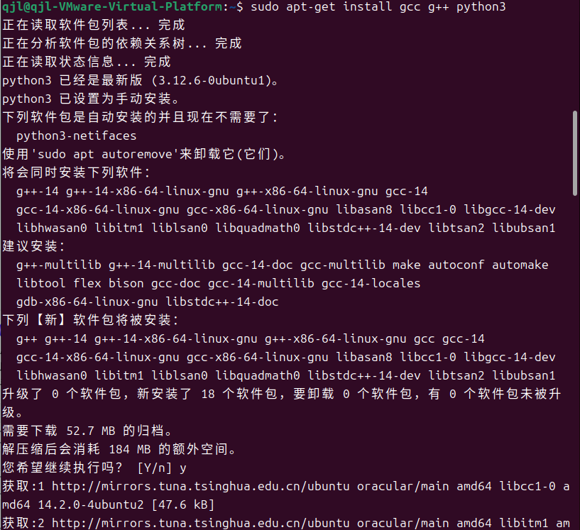

图 2 安装相关依赖

## 下载NS-3

我们使用的是ns-allinone-3.4.4版本，首先在官网下载压缩包[ns-3.44 | ns-3](https://www.nsnam.org/releases/ns-3-44/)：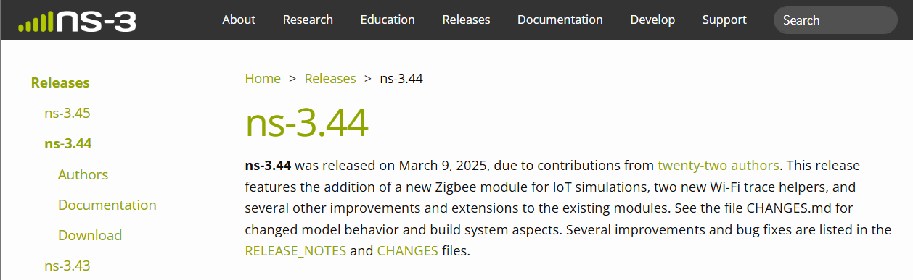

图 3 从官网下载压缩包

压缩包下载后存放至非root文件夹中，并解压：

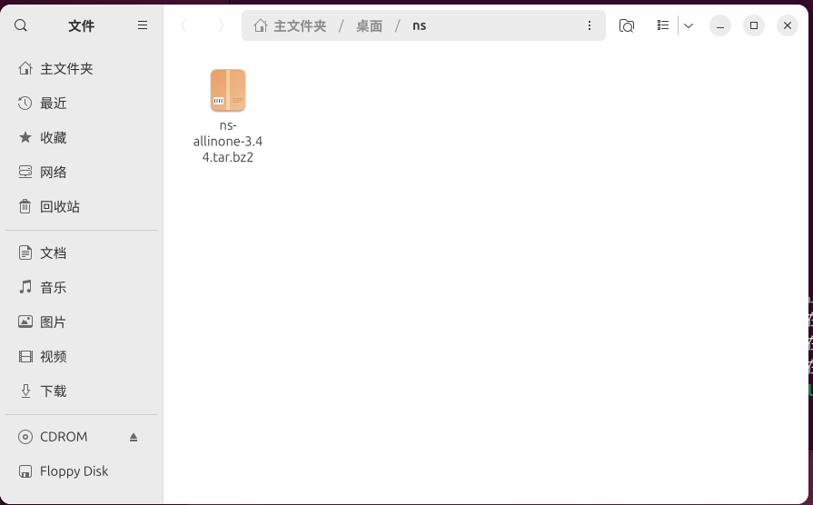

图 4 下载压缩包

解压后可以看到压缩包中包含了bake、ns-3.44等文件，其中build.py为编译脚本、bake为编译器、netainim为图像显示环境、ns-3.44为系统根目录：

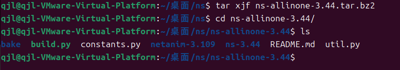

图 5 解压

## 构建NS-3

在命令行输入./build.py编译，构建时间根据 CPU 核心数量、CPU 和内存的速度以及构建模式所不同：

图 6 构建

假如编译过程中中断，不可使用上述命令进行继续编译，会报如下错误：

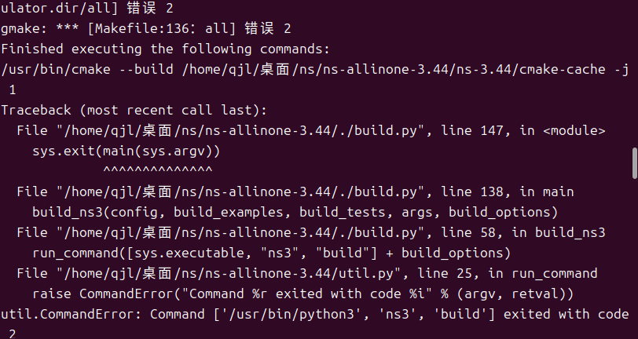

图 7 编译报错

此时，应该进入ns-allinone-3.44/ns-3.44/build目录，使用cmake命令继续编译，也可以清除旧编译缓存，重新编译：

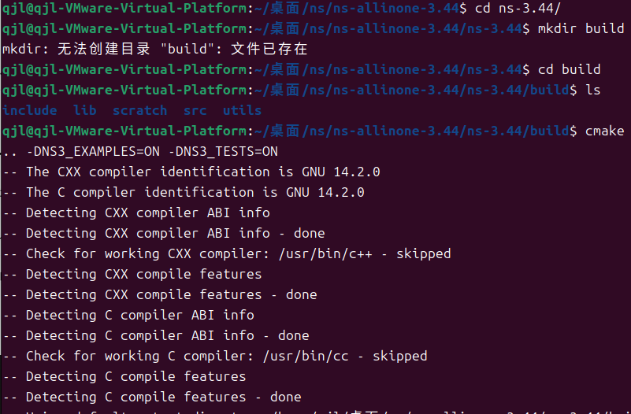

图 8 继续编译

编译成功有如下显示：

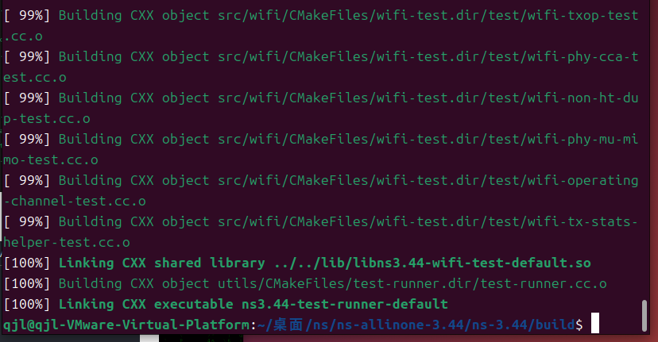

图 9 编译成功

## 测试NS-3

构建完成后，我们可以运行示例测试NS-3能否正常运行。首先输入命令./ns3 configure --enable-examples --enable-tests构建examples和tests的配置：

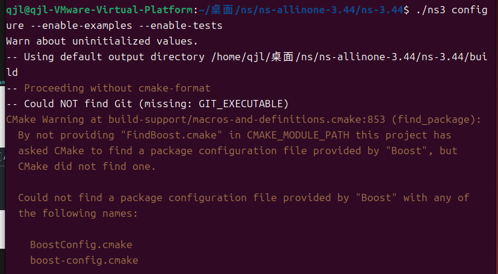

图 10 构建配置

成功后配置中Examples和Tests应均为ON：

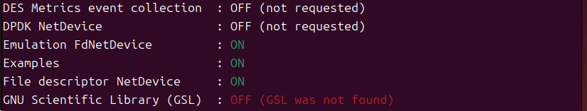

图 11 配置成功

输入./ns3 run first即可运行第一个样例，并正确显示结果：

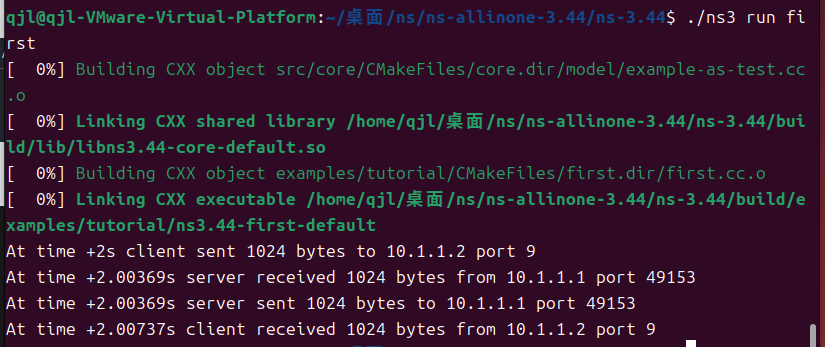

图 12 样例运行成功

